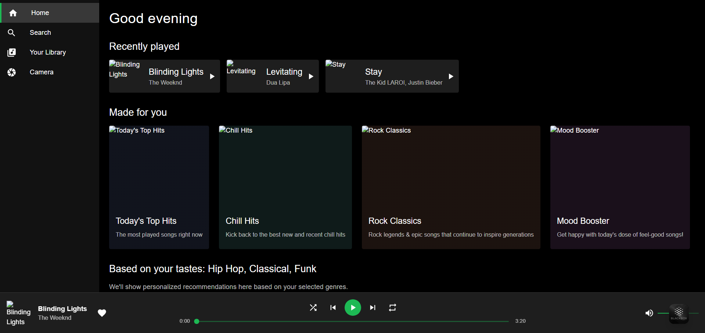
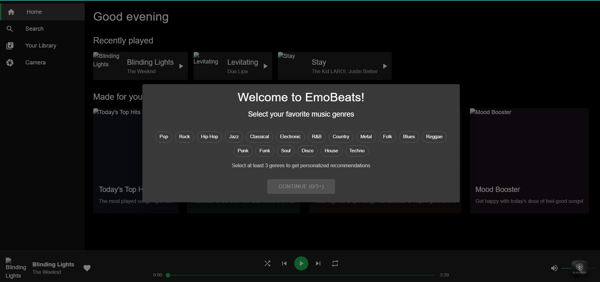
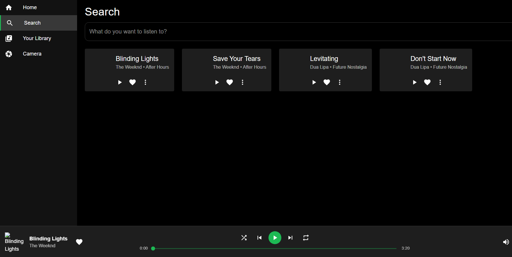
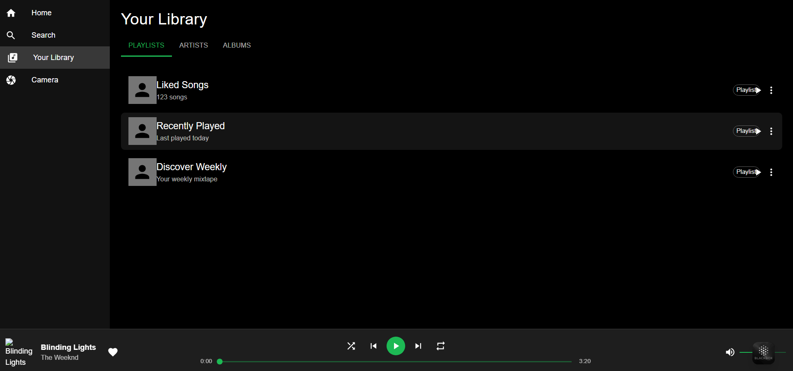
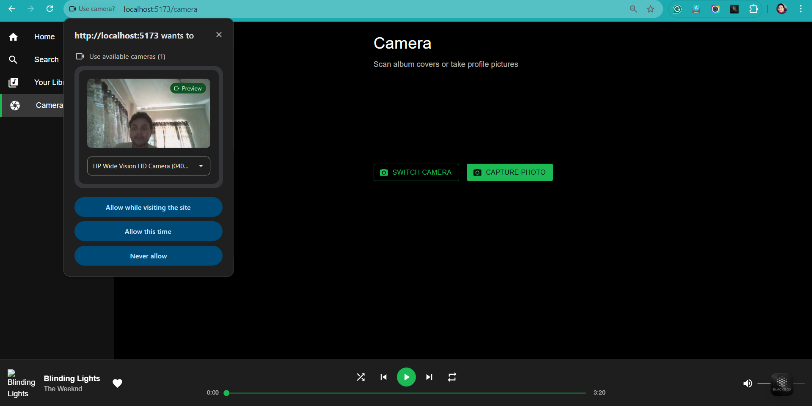

# 🎵 emoBeats - Spotify Clone

A modern, responsive Spotify-inspired music streaming application built with React and Material-UI.

## ✨ Features

- **🎨 Modern UI**: Dark theme interface inspired by Spotify's design
- **🎭 Genre Selection**: Personalized music recommendations based on your favorite genres
- **🏠 Home Dashboard**: Displays recently played tracks and personalized playlists
- **🔍 Search Functionality**: Find your favorite songs, artists, and albums
- **📚 Library Management**: Organize your playlists, artists, and albums
- **📷 Camera Integration**: Scan album covers or take profile pictures using webcam
- **🎵 Music Player**: Full-featured audio player with controls and progress tracking
- **📱 Responsive Design**: Works seamlessly on desktop and mobile devices

## 🛠️ Tech Stack

- **Frontend**: React 19.1.1
- **Build Tool**: Vite 7.1.7
- **UI Framework**: Material-UI (MUI) 7.3.2
- **Routing**: React Router DOM 7.9.2
- **Styling**: Emotion (CSS-in-JS)
- **Icons**: Material-UI Icons & Lucide React
- **Camera**: React Webcam
- **Audio**: Howler.js (ready for integration)

## 🚀 Getting Started

### Prerequisites

- Node.js (version 16 or higher)
- npm or yarn package manager

### Installation

1. **Clone the repository**
   ```bash
   git clone https://github.com/KunalChakraborty445/emoBeats.git
   cd emoBeats
   ```

2. **Install dependencies**
   ```bash
   npm install
   ```

3. **Start the development server**
   ```bash
   npm run dev
   ```

4. **Open your browser**
   Navigate to `http://localhost:5173` (or the port shown in terminal)

## 📁 Project Structure

```
client/
├── public/
│   ├── vite.svg
│   └── itunes-svgrepo-com.svg
├── src/
│   ├── components/
│   │   ├── Camera.jsx          # Webcam integration
│   │   ├── GenrePopup.jsx      # Initial genre selection
│   │   ├── Home.jsx            # Main dashboard
│   │   ├── Library.jsx         # User's music library
│   │   ├── Player.jsx          # Music player component
│   │   ├── Search.jsx          # Search functionality
│   │   └── Sidebar.jsx         # Navigation sidebar
│   ├── App.jsx                 # Main app component
│   ├── App.css                 # Global styles
│   └── main.jsx               # App entry point
├── package.json
├── vite.config.js
└── README.md
```

## 🎯 Available Scripts

- `npm run dev` - Start development server
- `npm run build` - Build for production
- `npm run preview` - Preview production build
- `npm run lint` - Run ESLint

## 🎨 Key Components

### 🏠 Home Component
- Displays recently played tracks
- Shows personalized playlists
- Genre-based recommendations

### 🔍 Search Component
- Real-time search functionality
- Filter by songs, artists, albums
- Interactive search results

### 📚 Library Component
- Tabbed interface (Playlists, Artists, Albums)
- User's saved content
- Easy content management

### 🎵 Player Component
- Play/pause controls
- Track progress slider
- Volume control
- Skip previous/next
- Shuffle and repeat modes

### 📷 Camera Component
- Webcam integration
- Photo capture functionality
- Album cover scanning (ready for implementation)

## 🎭 Personalization

On first visit, users are prompted to select their favorite music genres:
- Pop, Rock, Hip Hop, Jazz, Classical, Electronic
- R&B, Country, Metal, Folk, Blues, Reggae
- Punk, Funk, Soul, Disco, House, Techno

The app uses these preferences to provide personalized recommendations.

## 🌟 Future Enhancements

- [ ] Real music streaming integration
- [ ] User authentication
- [ ] Playlist creation and management
- [ ] Social features (sharing, following)
- [ ] Offline playback
- [ ] Advanced search filters
- [ ] Album cover recognition via camera
- [ ] Music visualization

## 🤝 Contributing

1. Fork the repository
2. Create your feature branch (`git checkout -b feature/AmazingFeature`)
3. Commit your changes (`git commit -m 'Add some AmazingFeature'`)
4. Push to the branch (`git push origin feature/AmazingFeature`)
5. Open a Pull Request

## 📝 License

This project is open source and available under the [MIT License](LICENSE).

## 👨‍💻 Author

**Kunal Chakraborty**
- GitHub: [@KunalChakraborty445](https://github.com/KunalChakraborty445)

## 📸 Screenshots

### 🏠 Home Dashboard


### 🎭 Genre Selection


### 🔍 Search Interface


### 📚 Music Library


### 📷 Camera Feature



---

⭐ Star this repository if you found it helpful!
